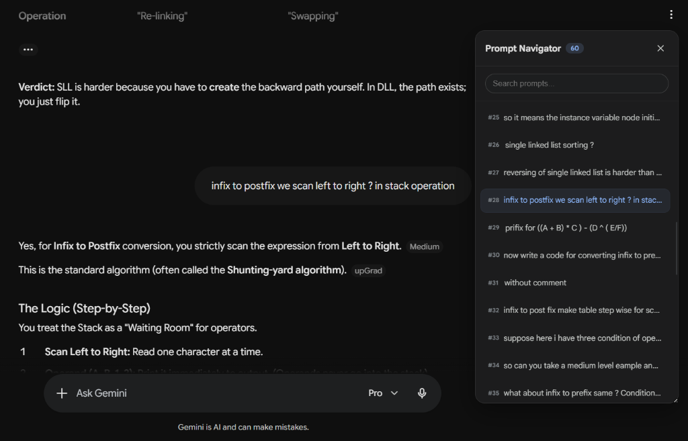
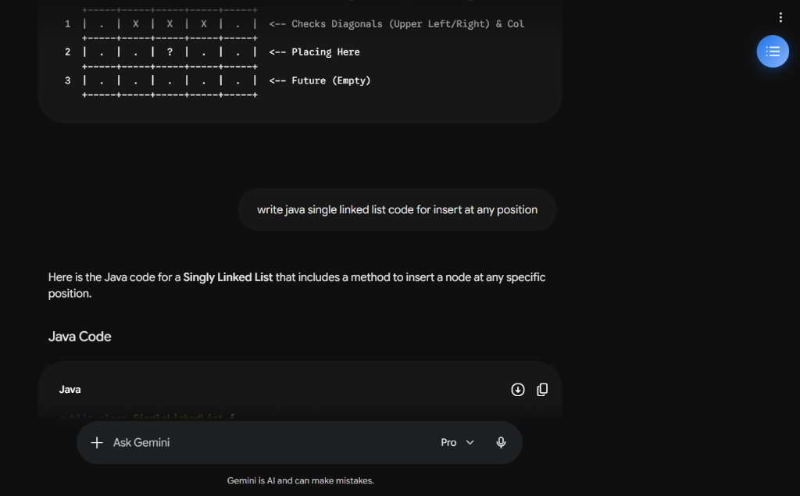

<p align="center">
  
</p>

<h1 align="center">Gemini Prompt Navigator</h1>

<p align="center">
  
  
  
</p>

<p align="center">
  <b>A premium, lightweight browser extension that injects a smart, draggable, and searchable Table of Contents sidebar directly into Google Gemini sessions.</b>
</p>

<p align="center">
  
  
</p>

---

## 🛑 The Problem
If you use Gemini for coding, writing, or researching, your threads quickly grow into massive scrolls. **Gemini has no native prompt list.** Finding a past prompt requires endless manual scrolling, breaking your flow.

## 🚀 The Solution
A floating sidebar widget that indexes your conversation in real time. It parses prompt structures, builds a live Table of Contents, and adds premium features:

*   **🔍 Search Filtering:** Instant text search filters the prompt list dynamically.
*   **🎯 Precision Navigation:** Click any prompt to scroll instantly to it with a clean visual flash animation.
*   **🎛 Drag & Resize Memory:** Position it anywhere or drag to scale. It saves your layout preferences automatically.
*   **🌀 Staggered Cascade:** Smooth 1-second animations drop prompts dynamically from the top or slide from the bottom.

---

## 🛠 Architected for Reliability (The "Why")

This extension isn't just DOM scripts—it is built with robust extension principles:
*   **Context Loss Guard:** Chrome invalidates background scripts on updates/reloads. We explicitly track runtime validation (`chrome.runtime`) and auto-clean DOM elements/MutationObservers to avoid memory leaks or duplicate sidebars.
*   **Performance Cache Loop:** The scanner debounces updates at `300ms` and compares parsed prompts with a cached snapshot. If the content is identical, it skips expensive rendering and animation loops.
*   **Boundaries & Coordinates:** Sidebar scaling and dragging translate client coordinates directly to keep drag boundaries synchronized with the viewport limits.

---

## 📂 Project Structure

```text
gemini-navigator/
├── manifest.json   # Manifest V3 setup and scopes
├── content.js      # DOM scanner, debounce observers, dragging, and coordinate translation
├── styles.css      # Glassmorphic panels, spring keyframe transitions, and dark/light themes
├── popup.html/.js  # Extension settings panel (toggle expand-on-load behavior)
└── icon-128.png    # Extension list icon artwork
```

---

## ⚡ Quick Setup

1.  Clone or download this folder.
2.  Open Chrome and navigate to `chrome://extensions/`.
3.  Enable **Developer mode** in the top right.
4.  Click **Load unpacked** in the top left and select this folder.
5.  Visit [Google Gemini](https://gemini.google.com) and click the blue toggle button to try it out!
